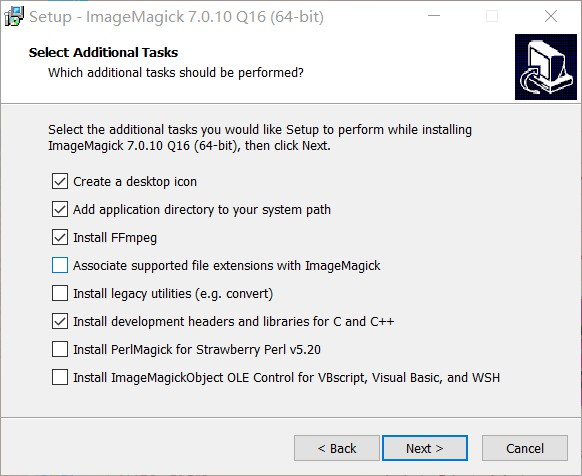

Forked from https://github.com/chrisidefix/nurbs

Details please refer to [README](README)

```
This is the NURBS++ library a library to manipulate and create NURBS curves 
and surfaces.

The information about the library are available from the website at
	https://launchpad.net/nurbs++/
```

License:

GNU LGPL v3


# My Main Job

1. Upgrade VC6.0 prject to visual studio 2019 solution and run example succussfully.

# My compile environment

Windows SDK Version: `10.0 (latest installed version)` --> `10.0.18362.0`
Platform Toolset: `Visual Studio 2019 (v142)`

# Others

1. Thanks a lot to [chrisidefix](https://github.com/chrisidefix)'s wonderful contribution. Other more information please refer to https://launchpad.net/nurbs++/.
2. Hopefully, this work will help your job.


# My notes

## postscript format

postfix is `.ps`, this format can be read and convert by Adobe Acrobat Pro DC or other free postscript decode software, such as [ghostscript](https://www.ghostscript.com/). 

## IMAGE MAGICK

FAILED. 2020-5-17

If you have installed [IMAGE MAGICK](https://imagemagick.org/index.php), you can change `#undef WITH_IMAGE_MAGICK` to `#define WITH_IMAGE_MAGICK` .

IMAGE MAGICK DOWNLOAD LINK: https://imagemagick.org/script/download.php




## 

